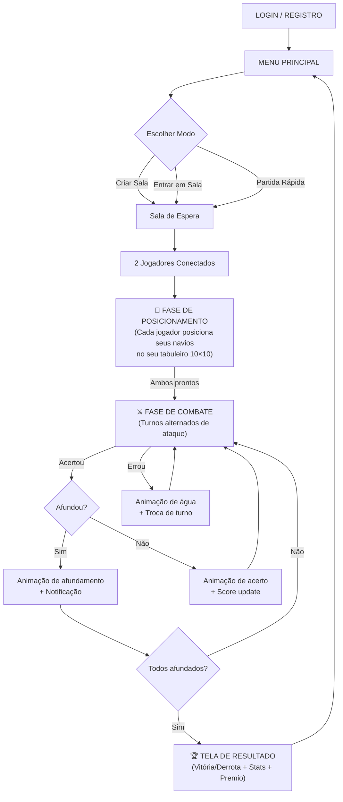

# 🎯 Análise Completa — Batalha do Estreito 2.0 (Multiplayer)

## Diagnóstico Geral

O jogo tem uma **base de backend sólida** (autenticação, ranking ELO, apostas, Socket.io), mas o **frontend está incompleto e desalinhado** com as regras clássicas de Batalha Naval. A experiência do usuário sofre em 3 áreas críticas:

---

## 🔴 Problemas Críticos de Gameplay

### 1. **Não existe fase de posicionamento de navios**

> [!CAUTION]
> Este é o problema mais grave. Na Batalha Naval clássica, **cada jogador posiciona seus próprios navios** antes de começar a jogar. No código atual, o servidor gera os navios aleatoriamente em `generateShipsBoard()` ([server.js:494-533](file:///c:/Users/henrique/Desktop/batalha-do-estreito-2.0/deepseek/server.js#L494-L533)) e o jogador **nunca vê onde seus navios estão**.

**Regra clássica:** Cada jogador tem um tabuleiro onde posiciona seus navios manualmente (drag & drop ou clique + rotação) antes da partida começar.

**Impacto:** Sem essa fase, o jogo perde 50% da sua essência estratégica.

### 2. **Detecção de navio afundado com bug lógico**

```diff
- // server.js L551-556: Compara por TAMANHO, não por instância
- if (board[i][j] && board[i][j].size === shipSize && board[i][j] !== 'hit') {
+ // Deveria rastrear cada navio com um ID único
+ if (board[i][j] && board[i][j].shipId === shipId && board[i][j] !== 'hit') {
```

O código atual verifica se **todos os navios do mesmo tamanho** foram atingidos, não se **aquele navio específico** foi afundado. Exemplo: se existem 2 navios de tamanho 3, acertar todas as partes do primeiro **não vai detectar que ele afundou** até que AMBOS estejam destruídos.

### 3. **O jogador não vê seus próprios navios**

O tabuleiro "MEU TABULEIRO" é renderizado vazio — a grid é criada em [script.js:474-496](file:///c:/Users/henrique/Desktop/batalha-do-estreito-2.0/deepseek/public/script.js#L474-L496) mas nunca recebe os dados de posição dos navios do servidor.

### 4. **Grid 9×9 em vez de 10×10**

A Batalha Naval clássica usa um tabuleiro **10×10** (A-J, 1-10). O jogo usa 9×9, o que reduz o espaço tático e dificulta o posicionamento da frota completa.

### 5. **Sem coordenadas no tabuleiro**

Não há letras (A-I) nas colunas nem números (1-9) nas linhas. Isso torna impossível comunicar ou registrar jogadas como "B4" ou "G7".

---

## 🟡 Problemas de UX e Imersão

### 6. **Transições de tela sem animação**

As telas são trocadas com `display: none` → `display: flex`. Sem fade, slide ou qualquer transição, a experiência é "brusca".

### 7. **Ranking e Histórico mostrados de forma primitiva**

- **Ranking:** Abre um JSON cru em nova aba (`window.open('/api/ranking')`).
- **Histórico:** Exibe um `alert()` com texto formatado.

### 8. **Feedback sonoro inexistente**

Nenhum som de tiro, acerto, água, afundamento, vitória ou derrota. O jogo é completamente silencioso.

### 9. **Timer sem feedback visual urgente**

O timer de 30 segundos não muda de cor quando está acabando. Sem barra de progresso visual, sem pulsar vermelho nos últimos 10 segundos.

### 10. **Confirmação de desistência usa `confirm()` nativo**

A função `forfeit()` usa `confirm()` do browser em vez do modal customizado que já existe no CSS do `index.html`.

---

## 🟠 Problemas Visuais / Design

### 11. **CSS básico, sem design premium**

| Aspecto | Versão Original (batalha_do_estreito) | Versão Multiplayer (deepseek) |
|---|---|---|
| Font | Orbitron + Inter (Google Fonts) | Arial (genérico) |
| CSS Variables | ✅ `--primary`, `--accent`, `--gold`, etc. | ❌ Cores hardcoded |
| Glassmorphism | ✅ `backdrop-filter: blur(20px)` | ❌ Nenhum |
| Scanlines Effect | ✅ Efeito CRT tático | ❌ Nenhum |
| HUD Drone FPV | ✅ Crosshair, telemetria, REC blink | ❌ Nenhum |
| Animações | ✅ GSAP, feedback dinâmico | ❌ Apenas `pulse` e `explode` |

### 12. **O header não tem estilo**

O `index.html` tem `.logo-main` e `.logo-sub` mas o `style.css` não define essas classes. Elas existem apenas no CSS da versão original.

### 13. **Emojis como gráficos**

As células do tabuleiro usam emojis (💥, 💧) para representar acertos e erros. Funciona, mas não é visualmente premium. Deveria usar ícones SVG ou animações CSS.

---

## ✅ Plano de Otimização — 5 Fases

### FASE 1 — Corrigir Regras de Batalha Naval
| Tarefa | Prioridade |
|---|---|
| Tabuleiro **10×10** com coordenadas A-J / 1-10 | 🔴 Crítica |
| **Fase de posicionamento** de navios (drag & drop + rotação) | 🔴 Crítica |
| Corrigir detecção de afundamento com **ID único por navio** | 🔴 Crítica |
| Mostrar navios próprios no "MEU TABULEIRO" | 🔴 Crítica |
| Frota padrão: Porta-aviões (5), Encouraçado (4), Cruzador (3), Submarino (3), Destroyer (2) | 🟡 Importante |

### FASE 2 — Upgrade Visual Completo
| Tarefa | Prioridade |
|---|---|
| Importar fontes **Orbitron + Inter** | 🔴 Crítica |
| Implementar **CSS variables** com paleta do original | 🔴 Crítica |
| **Glassmorphism** em todos os containers | 🟡 Importante |
| **Scanlines** CRT para imersão tática | 🟡 Importante |
| Animação **ripple** ao clicar numa célula | 🟡 Importante |
| Efeito de **onda** nas células de água (miss) | 🟢 Bônus |

### FASE 3 — UX e Feedback
| Tarefa | Prioridade |
|---|---|
| **Transições** de tela com fade/slide CSS | 🔴 Crítica |
| **Modal** de ranking com top 10 in-game | 🟡 Importante |
| **Modal** de histórico com cards visuais | 🟡 Importante |
| Timer com **barra de progresso** + pulso vermelho | 🟡 Importante |
| Usar modal customizado para **desistência** | 🟢 Bônus |
| **Efeitos sonoros** (tiro, splash, explosão, vitória) | 🟢 Bônus |

### FASE 4 — Tela de Resultado (Game Over)
| Tarefa | Prioridade |
|---|---|
| Modal de vitória com **confetti** e animação dourada | 🟡 Importante |
| Modal de derrota com efeito de **static/glitch** | 🟡 Importante |
| Resumo da partida (acertos, erros, tempo, navios afundados) | 🟡 Importante |
| Botão "REVANCHE" para rematch imediato | 🟢 Bônus |

### FASE 5 — Integração dos Assets 3D
| Tarefa | Prioridade |
|---|---|
| Animação de **drone FPV** durante ataques (inspirada no original) | 🟢 Bônus |
| Canvas 3D com Three.js para visualização de ataque | 🟢 Bônus |
| HUD tático do drone durante sequência de ataque | 🟢 Bônus |

---

## 🎮 Fluxo Ideal da Partida (Pós-Otimização)



---

## 🔑 Resumo Executivo

| Categoria | Estado Atual | Objetivo |
|---|---|---|
| Regras de Batalha Naval | ❌ Incompleto (sem posicionamento, bug de afundamento) | ✅ 100% fiel ao clássico |
| Visual / Design | ⚠️ Básico (Arial, sem glass, sem animações) | ✅ Premium tático militar |
| UX / Feedback | ⚠️ Alert/confirm nativos, sem transições | ✅ Modais, notificações, sons |
| Game Over | ❌ Apenas `alert()` | ✅ Modal cinematográfico |
| Backend | ✅ Sólido (ELO, apostas, JWT) | ✅ Manter e refinar |

> [!IMPORTANT]
> **Recomendação:** Comece pela **Fase 1** (regras corretas) antes de qualquer polimento visual. Um jogo bonito com regras erradas frustra mais do que um jogo simples com gameplay correto.
