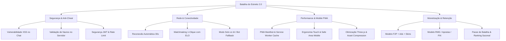

# ⚓ Relatório de Análise Completa & Backlog de Viabilidade Comercial
### Projeto: **Batalha do Estreito 2.0 — Web App / PWA Mobile**
**Data de Emissão:** 17 de Agosto de 2026

---

## 1. Sumário Executivo & Diagnóstico do Projeto

O **Batalha do Estreito 2.0** possui uma base técnica com grande diferencial competitivo: a **fusão do clássico Batalha Naval com um motor 3D cinematográfico em Three.js** (mergulho de drones kamikaze Shahed-136, defesas antiaéreas Flak 88mm, visão FPS de contra-ataque e ambientação tática).

No entanto, o projeto encontra-se atualmente em estágio de **Protótipo Avançado / Alpha**. Para se tornar um **produto comercial viável, seguro, escalável e lucrativo via Web App / PWA Mobile**, existem lacunas estruturais que precisam ser resolvidas para garantir alta taxa de conversão, instalação direta no smartphone e jogabilidade sem travamentos.

---

## 2. Auditoria Técnica Aprofundada

### 🔴 2.1. Vulnerabilidades Críticas & Segurança
1. **Brecha de XSS (Cross-Site Scripting) no Chat**: Em `script.js`, as mensagens e nomes de usuário são injetados diretamente via `innerHTML` sem sanitização HTML. Um usuário malicioso pode enviar `<script>` ou `` para roubar o token JWT de outros jogadores no `localStorage`.
2. **Zero Validação de Posicionamento no Backend (Anti-Cheat)**: Em `server.js`, o evento `ships_placed` confia cegamente no tabuleiro enviado pelo cliente. Um cliente modificado pode enviar tabuleiros sem navios, navios sobrepostos ou de tamanhos arbitrários.
3. **Segredo JWT Hardcoded**: Em `server.js`, `JWT_SECRET = 'batalha_naval_secret_key_2026'` está estático no código sem fallback dinâmico via variáveis de ambiente (`.env`).
4. **Falta de Rate Limiting**: Não há proteção contra ataques de força bruta no login/registro nem throttling em eventos de socket (DoS/flood).

### 🟡 2.2. Resiliência de Rede & Experiência de Jogo
1. **Ausência de Reconexão e Sincronização de Estado**: Em conexões móveis (4G/5G), uma oscilação de sinal ou troca momentânea de app desconecta o socket. O servidor tem um timer de 30s para declarar derrota, mas **não existe rota/evento de `reconnect_match`** para o jogador restaurar o tabuleiro e continuar a partida.
2. **Matchmaking Manual (Gargalo de Retenção)**: O jogo depende de criar salas manuais ou procurar no lobby. Para escala comercial, é mandatório ter um botão **"Batalha Rápida (1-Clique)"** com fila pareada por MMR/ELO.
3. **Efeito "Sala Vazia" (Falta de Bots de IA)**: Se um jogador novo entrar e não encontrar ninguém online em 15 segundos, ele abandona o site. É crucial ter um **Modo Treino (Solo vs IA)** e **Bots com nomes humanizados** para preencher a fila quando o tempo de espera exceder 10 segundos.

### 🟢 2.3. Performance, Otimização & Mobile (PWA)
1. **Peso Excessivo de Assets**: Imagens PNG no diretório `assets` chegam a **7-8 MB cada** e o modelo `t-22.glb` possui 8 MB. Em redes móveis, o carregamento inicial fica lento. É necessário converter imagens para **WebP/AVIF** e comprimir os modelos GLB com **Draco/Meshopt Compression** (reduzindo até 75% do tamanho).
2. **Áudio Sintetizado vs Sound Design HQ**: O `AudioManager` atual usa ondas de oscilador senoidais/sawtooth via Web Audio API. Para transmitir impacto bélico premium, o jogo precisa de efeitos sonoros estéreo gravados (turbinas de drone, sirenes de radar, explosões subaquáticas, tiros de canhão, trilha sonora tática e vozes de comando).
3. **Recursos PWA Incompletos**: Falta `manifest.json`, Service Worker com cache estratégico de assets 3D, ícones em múltiplas resoluções, banner de instalação customizado ("Instalar no Celular") e suporte a tela cheia nativa em smartphones (iOS Safari e Android Chrome).

---

## 3. Definição do Modelo Comercial

Para viabilizar financeiramente o web app, você pode adotar um dos dois caminhos (ou um formato híbrido):

| Critério | Opção A: Free-to-Play + IAP + Ads (Recomendado) | Opção B: Skill-Gaming / Apostas (Real Money) |
|---|---|---|
| **Público-Alvo** | Global, Casual, Competitivo, Portais Web (CrazyGames, Poki, PWA direto) | Adultos (18+), apostadores e jogadores competitivos |
| **Monetização** | Vídeos premiados (ganhar moedas), anúncios intersticiais, passe de batalha, loja de skins de drones/navios | Taxa sobre apostas (Rake 5% a 10% por partida) |
| **Barreira Regulatória** | Baixa / Nenhuma (lançamento imediato global) | Alta (Conformidade jurídica, LGPD, licenças de apostas/jogos de habilidade) |
| **Infraestrutura** | Moeda virtual + Pagamentos Simples (Stripe/Mercado Pago para cosméticos) | Gateway PIX automatizado, Ledger financeiro com auditoria, KYC, antifraude |

---

## 4. Lista Completa de Tarefas Restantes (Backlog de Produção)

### 🛡️ FASE 1: Segurança, Integridade & Anti-Cheat (Urgência Imediata)
- [ ] **[Backend] Garantir Criação de Diretório do SQLite**: Adicionar `fs.mkdirSync(path.join(__dirname, 'database'), { recursive: true })` na inicialização do servidor para evitar crashes em ambientes limpos.
- [ ] **[Segurança] Sanitização Anti-XSS**: Implementar escape de tags HTML em todas as mensagens de chat, nomes de usuário e notificações antes de renderizar no DOM.
- [ ] **[Segurança] Variáveis de Ambiente & JWT**: Migrar `JWT_SECRET`, portas e configurações para arquivo `.env` seguro.
- [ ] **[Backend] Validador de Tabuleiro no Servidor (Anti-Cheat)**:
  - Validar se a frota recebida em `ships_placed` contém exatamente os 5 navios esperados (tamanhos 5, 4, 3, 3, 2).
  - Validar se todas as células estão dentro do limite 10x10 e sem sobreposição.
  - Rejeitar tabuleiros adulterados e penalizar clientes maliciosos.
- [ ] **[Backend] Validador de Ações de Tiro**: Bloquear disparos repetidos na mesma célula (`hit` ou `miss`) e validar turno estritamente no servidor.
- [ ] **[Segurança] Rate Limiting & Helmet**: Instalar `express-rate-limit` (para endpoints de login/registro) e `helmet` para configurar cabeçalhos de segurança HTTP.

---

### 🎮 FASE 2: Core Gameplay, IA & Matchmaking Inteligente
- [ ] **[Rede] Sistema de Reconexão (Session Resume)**:
  - Gerar token de sessão por partida para permitir que um jogador que recarregou a página ou teve oscilação no 4G retorne à mesma partida em até 30s.
  - Sincronizar o estado completo do tabuleiro (`myBoard`, `enemyBoard`, turno atual, timer restante) no evento de reconexão.
- [ ] **[Multiplayer] Fila de Matchmaking 1-Clique ("Batalha Rápida")**:
  - Criar fila automática com pareamento por proximidade de ELO.
  - Adicionar convite direto com link compartilhável (ex: `batalhadoestreito.com/?sala=XYZ123` para enviar no WhatsApp/Discord).
- [ ] **[Gameplay] Modo Solo / Treino vs IA**:
  - Desenvolver algoritmo de IA com 3 níveis (Fácil: tiros aleatórios; Médio: foca em células adjacentes ao acertar; Difícil: algoritmo de caça com mapa de probabilidade térmica).
- [ ] **[Multiplayer] Bot Fallback na Fila**: Se o jogador aguardar mais de 12 segundos na fila de espera, conectar suavemente a um bot com nome realista para garantir partida imediata.
- [ ] **[Social] Opção de Revanche**: Botão "Solicitar Revanche" no modal de fim de partida sem precisar recriar a sala.

---

### 📱 FASE 3: Otimização PWA Mobile & Experiência de App Nativo
- [ ] **[PWA] Manifesto Web App (`manifest.json`)**:
  - Configurar `display: "standalone"`, `orientation: "landscape"` (ou adaptável com trava), theme color tática `#050b14`, background color e splash screen nativa.
  - Gerar ícones PWA nítidos em resoluções 192x192, 512x512 e `maskable_icon`.
- [ ] **[PWA] Service Worker com Cache Inteligente**:
  - Cache First para assets estáticos (modelos 3D GLB, áudios, texturas, Three.js, GSAP).
  - Network First para requisições de API e Socket.
  - Suporte completo a inicialização instantânea sem tela branca em celulares.
- [ ] **[PWA] Banner Personalizado de Instalação ("Instalar App")**:
  - Interceptar evento `beforeinstallprompt` do Chrome/Android para exibir um modal tático estilizado convidando o jogador a adicionar à tela inicial.
  - Guia visual passo a passo para usuários de iOS Safari ("Compartilhar" -> "Adicionar à Tela de Início").
- [ ] **[Mobile Ergonomics] Viewport & Safe Areas**:
  - Correção de altura móvel `100dvh` (Dynamic Viewport Height) para evitar barras de navegação do navegador cortando botões.
  - Suporte a Safe Area Insets (`env(safe-area-inset-top)`, `env(safe-area-inset-bottom)`) para iPhones com notch e celulares com punch-hole camera.
  - Detector de orientação com overlay elegante quando o celular estiver em modo retrato inadequado.
- [ ] **[Mobile Touch & Gestures] Calibração de Toque no 3D**:
  - Otimização do Raycaster Three.js para toques com margem de tolerância (evitando cliques falsos ao arrastar a tela).
  - Prevenção de pull-to-refresh acidental e zoom duplo-toque (`touch-action: manipulation`).

---

### ⚡ FASE 4: Otimização de Performance & Assets 3D para Celulares
- [ ] **[3D Performance] Perfil Gráfico Adaptativo**:
  - Ajuste de `pixelRatio` automático (máximo 1.5 a 2.0 em celulares de alta densidade para não superaquecer).
  - Redução de resolução de sombras e contagem de partículas em dispositivos móveis de entrada.
- [ ] **[Assets 3D] Compressão de Modelos GLTF**:
  - Comprimir `desert_city.glb`, `t-22.glb`, `iranian_shahed-136` e `minigun_animated.glb` usando Draco/Meshopt.
- [ ] **[Assets 2D] Otimização de Imagens**:
  - Converter todas as imagens pesadas de 7-8 MB em `assets/images/` para formato WebP/AVIF comprimido (reduzindo para menos de 300 KB cada).
- [ ] **[Sound Design] Biblioteca de Áudio HQ com Controle de Volume**:
  - Integrar efeitos sonoros nítidos e leves em formato `.mp3` / `.ogg` com fallback e carregamento assíncrono.

---

### 💰 FASE 5: Sistema de Monetização, Economia & Retenção
- [ ] **[Economia] Moeda Virtual do Jogo (Ouro / Créditos de Guerra)**:
  - Tabela de saldo no banco de dados (`wallet_balance`, `chips`, transações de recompensa).
  - Recompensa diária de login (Daily Streak Bonus).
  - Moedas obtidas por vitórias e missões completadas.
- [ ] **[Monetização - Anúncios] Integração de Redes de Anúncios**:
  - Suporte a SDKs de portais web (CrazyGames SDK, Poki SDK ou Google AdSense for Games / H5 Games Ads).
  - Anúncio em vídeo recompensado (ex: "+200 Créditos após vitória" ou "Girar Roleta Tática").
- [ ] **[Monetização - Loja de Cosméticos]**:
  - Skins de Drones (Drone Dourado, Drone Stealth Camo, Drone Laser Azul).
  - Traçantes de Tiros Personalizados (Verde Plasma, Vermelho Neon, Fogo Puro).
  - Títulos militares (Recruta, Capitão de Corveta, Almirante do Estreito).
- [ ] **[Retenção] Sistema de Conquistas & Temporadas**:
  - Conquistas desbloqueáveis (ex: "Primeiro Sangue", "Tiro Cego", "10 Vitórias Seguidas").
  - Reset de Ranking ELO com recompensas sazonais mensais.

---

### 🚀 FASE 6: DevOps, Infraestrutura & Deploy
- [ ] **[DevOps] Containerização com Docker**:
  - Criar `Dockerfile` e `docker-compose.yml` otimizados para deploy em 1 clique (Render, Railway, Fly.io ou VPS DigitalOcean/AWS).
- [ ] **[Testes] Bateria de Testes Automatizados**:
  - Expandir a suíte de testes `game-logic.test.js` para cobrir rotas da API, autenticação, eventos de socket e simulação de carga de partidas concorrentes.
- [ ] **[SEO & Social Sharing]**:
  - Tags OpenGraph (`og:image`, `og:title`, `twitter:card`) com banner épico de prévia ao compartilhar partidas no WhatsApp, Twitter/X e Telegram.
- [ ] **[Monitoramento] Logs Estruturados & Healthcheck**:
  - Rota `/health` e integração com serviço de monitoramento de erros (Sentry ou Winston Logger).

---

## 5. Matriz de Prioridade & Roteiro de Execução

| Prioridade | Fase | Foco Principal | Impacto no Negócio |
|:---:|:---:|:---|:---|
| **P0 (Crítica)** | **Fase 1 & 3** | Segurança/Anti-cheat + PWA Completo & Otimização Mobile | App instalável no celular sem Play Store e livre de vulnerabilidades |
| **P1 (Alta)** | **Fase 2 & 4** | Reconexão 30s, Modo vs IA e Otimização 3D/Assets (Draco/WebP) | Jogo fluido em qualquer smartphone sem lag |
| **P2 (Média)** | **Fase 5** | Sistema de Moedas, Loja de Cosméticos, Recompensas Diárias e Ads | Monetização e sustentabilidade financeira do game |
| **P3 (Final)** | **Fase 6** | Docker, Deploy em Produção, SEO e Publicação | Escalar tráfego e distribuição comercial global |
